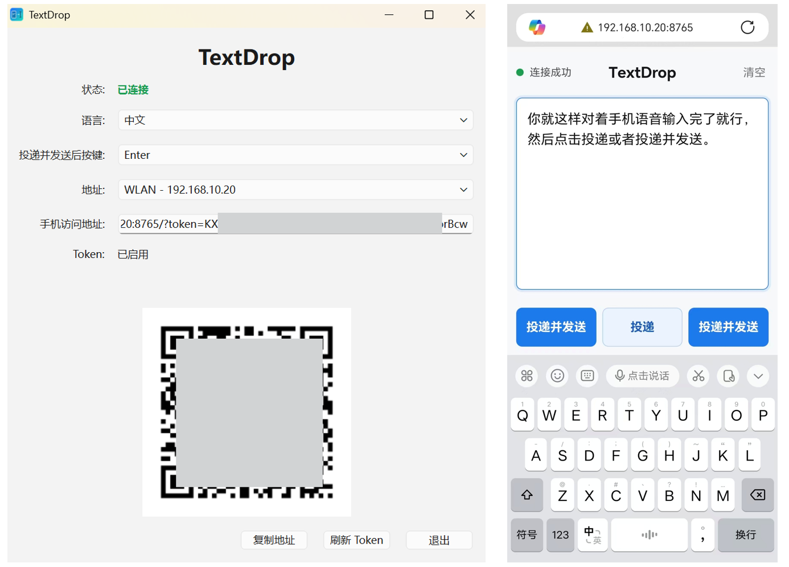

# TextDrop

TextDrop 是一个轻量级跨设备输入工具。用户可以在手机浏览器中输入文字，点击发送后，文本会通过 Windows 端程序粘贴到当前光标所在位置。

## 核心功能

- Windows 端运行桌面 GUI。当前仅支持Windows端，Mac端后续会增加适配。
- 手机端任意系统都可用，能扫描二维码即可，无需安装 App。微信扫码可行，但推荐在手机浏览器中使用。
- 发送文本时会覆盖系统剪贴板，并模拟 `Ctrl+V`。
- 手机端提供“投递”和“投递并发送”两种按钮。“投递”只粘贴文本；“投递并发送”会在粘贴后按 Windows 主界面配置的追加按键（Enter / Ctrl+Enter / Shift+Enter / Alt+Enter，默认关闭）。
- 不保存发送历史，不记录正文，不恢复原剪贴板。
- 不做云端连接、账号系统、托盘常驻和开机自启。
- v0.1.2 只支持同一局域网内使用，跨网络的云端支持后期根据需求上线。



## 使用说明

1. 在[这里](https://github.com/alone-tree/TextDrop/releases)下载最新版本的压缩包，然后解压。
2. 在解压后的 `TextDrop` 文件夹里启动 `TextDrop.exe`。
3. 首次使用如果 Windows 防火墙弹出提示，请允许专用网络访问。
4. 用手机扫描 Windows 主界面中的二维码。
5. 用手机扫描 Windows 主界面中的二维码。默认在 HTTP 协议下运行，手机扫码将 **绝对不会有任何安全警告，秒开直接使用**。若在 Windows 客户端开启了“启用 HTTPS (局域网加密)”，则手机浏览器首次打开时会提示“连接不安全”（局域网自签名证书的正常现象），确认地址来自自己的电脑后，在浏览器上点击“高级/显示详情”并选择“继续访问”即可。
6. 在手机页面输入文本。
7. 在电脑上点击目标输入框，让光标停在要输入的位置。
8. 点击手机页面底部的“投递”，或点击左右两侧的“投递并发送”。

**提示：个人开发，精力有限，没有做开发者认证，所以下载和首次启用时，可能会出现安全风险警示，点击允许即可。如果浏览器强制删除（比如某些Chrome），请更换浏览器。**

手机页面顶部有“常亮”按钮。点击后如果浏览器支持，按钮会变成“常亮中”，用于减少手机自动息屏。**此功能在安全上下文（HTTPS）下支持最佳**。如果您在普通的 HTTP 模式下点击常亮失败，可以回到电脑端勾选“启用 HTTPS (局域网加密)”并重新扫码访问；也可以直接在手机系统设置里调长自动锁屏时间作为降级手段。

如果电脑同时开启 VPN、系统代理或虚拟网卡，手机可能无法访问自动选择的地址。此时请在 Windows 主界面的地址下拉框里切换到与手机处于同一网络的地址，然后重新扫码。

TextDrop 运行时会每 3 秒检测一次本机地址。如果当前二维码里的地址已经失效，Windows 主界面会自动刷新访问地址和二维码，并提示重新扫码连接。

Windows 主界面的状态会显示手机是否已连接。手机页面用有效 Token 成功访问电脑端后显示已连接；如果一段时间没有手机页面成功访问，或地址、Token 发生变化，则显示未连接。

## 配置位置

配置文件默认保存到：

```text
%APPDATA%\TextDrop\config.json
```

配置包含 Token、语言设置和最近选择的地址。刷新 Token 后旧二维码和旧链接会失效，需要重新扫码。

## 开发运行

本项目开发环境统一使用 `uv`，避免依赖系统里的 `python` 命令。首次运行会自动创建 `.venv` 并安装依赖。`pyproject.toml` 要求 Python `>=3.11`，uv 会选择可用的兼容版本。

```powershell
.\scripts\run.ps1
```

也可以直接运行等价命令：

```powershell
uv run python -m textdrop
```

## 打包便携版 zip

打包同样走 `uv`，不需要手动激活虚拟环境：

```powershell
.\scripts\build.ps1
```

打包工具 PyInstaller 放在 `pyproject.toml` 的 `build` 依赖组里，日常开发运行不会额外安装它。

如果 `.venv` 曾经创建失败或被占用，先关闭正在运行的 TextDrop、Python 和编辑器终端，再删除 `.venv` 后重新运行上面的命令。

打包产物会生成：

- `dist\TextDrop-v0.1.2-windows\TextDrop\TextDrop.exe`
- `dist\TextDrop-v0.1.2-windows.zip`

打包前需要先关闭正在运行的 TextDrop，否则 Windows 可能占用 `dist` 目录中的依赖文件，导致构建脚本无法删除旧产物。

发布时优先使用 zip。用户解压后运行文件夹里的 `TextDrop.exe`，不要把 `TextDrop.exe` 单独移动出来，否则依赖文件缺失会导致程序无法运行。但可以复制`TextDrop.exe`的快捷方式，或者添加到任务栏，便于启动。


## 许可证

本项目采用 **GNU Affero General Public License v3 (AGPL v3)** 开源协议。

- 个人使用、学习、修改均不受限制。
- 禁止将本软件或修改后的版本以闭源形式发布或销售。
- 禁止将本软件作为网络服务提供而不开放源代码。
- 版权所有人保留额外授权的权利。

> 商业使用请联系作者授权。

---

如果这个工具对你有帮助，欢迎打赏、点赞、分享使用心得~


